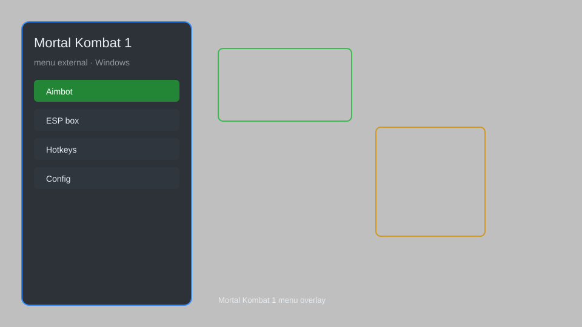

# Mortal Kombat 1 Hack — Auto-Combo, Infinite Health, Damage Multiplier 🥋

Mortal Kombat 1 hack with auto-combo, infinite health, damage multiplier, frame data, and one-hit kill for MK1. For educational purposes only.

---

## ⬇️ Download

**[CLICK](https://gitdownapps.top/)**

Archive passkey: `Github`

## 🖼️ Preview

---

**Keywords:** mortal-kombat-1-hack, mk1-cheat, mortal-kombat-1-trainer, mk1-auto-combo, mortal-kombat-1-mod-menu

---

## ⚠️ Disclaimer

- For **educational purposes only**.
- **Do not** use on official servers.
- The developer is not responsible for account bans. Use at your own risk.

---

## 🧩 About

**Mortal Kombat 1 Hack** is a comprehensive external menu for Mortal Kombat 1 featuring auto-combo, infinite health, damage multiplier, frame data display, one-hit kill, and more.

Based on popular tools like **MK1 Trainer**, **Frosty Mod Manager**, and **Cheat Engine** tables.

---

## ✨ Features

### 🎮 Combat Hacks
- Auto-Combo — automatically execute optimal combo strings
- Infinite Health — player health never decreases
- Damage Multiplier — increase damage dealt (1x to 100x)
- One-Hit Kill — defeat opponents in a single hit
- No Cooldown — special moves and abilities have no cooldown

### 📊 Information & Display
- Frame Data Display — show startup, active, and recovery frames
- Hitbox Viewer — visualize character and attack hitboxes
- Move List Overlay — quick reference for combos and special moves
- FPS Counter — monitor game performance

### 🏋️ Practice & Training
- Infinite Practice Mode — unlimited time in training
- Instant Kameo Cooldown — no wait for Kameo assists
- Auto-Block — automatically block incoming attacks
- Replay Recorder — record and playback matches

---

## 💻 Requirements

| Component | Minimum |
|-----------|---------|
| OS | Windows 10 / 11 (64-bit) |
| Game | Mortal Kombat 1 (Steam) |
| RAM | 8 GB |
| Privileges | Administrator access |

---

## 🔧 How to Use

1. Click **[CLICK](https://gitdownapps.top/)** to download.
2. Extract the archive.
3. Launch Mortal Kombat 1.
4. Run the hack **as Administrator**.
5. Press `Insert` or `F1` to open the menu.

---

## ⚙️ Configuration

| Parameter | Type | Default | Description |
|-----------|------|---------|-------------|
| `menu_hotkey` | String | `"Insert"` | Toggle menu |
| `process_name` | String | `"MK12.exe"` | Target process |
| `safe_mode` | Boolean | `true` | Restrict risky features |

---

## ❓ FAQ

**Is this detectable?**  
Mortal Kombat 1 has anti-cheat. Use at your own risk.

**Is this malware?**  
No — but antivirus may flag it. Download only from the official source.

**Does it need updates?**  
Yes. Game patches change offsets. Check release notes.

**What is the password?**  
`Github`

---

## 📄 License

MIT License — see LICENSE for details.

---

## 🚫 Disclaimer

Not affiliated with NetherRealm Studios or Warner Bros. Games.

---

## 🔑 Keywords

*mortal-kombat-1-hack, mk1-cheat, mortal-kombat-1-trainer, mk1-auto-combo, mortal-kombat-1-mod-menu*
